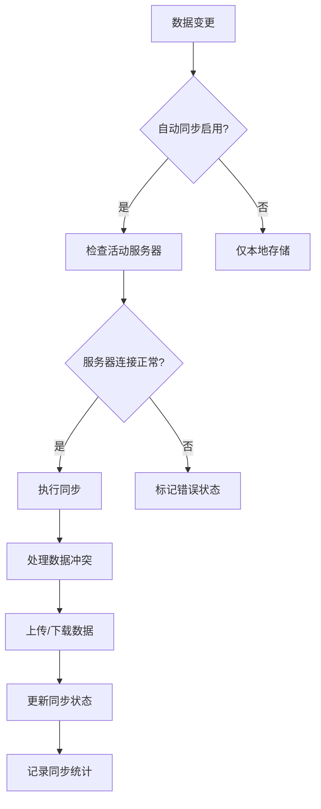

# 云同步功能使用指南

## 概述

本应用现在支持基于云服务器的数据同步功能，用户可以通过配置不同的云服务器来实现数据的自动保存和同步，无需传统的账号系统。

## 功能特性

### 🚀 核心功能
- **多服务器支持**: 支持配置多个云服务器
- **自动同步**: 可配置自动同步间隔（实时、5分钟、15分钟、30分钟、1小时）
- **冲突处理**: 支持本地优先、云端优先、询问用户三种冲突解决策略
- **实时监控**: 提供同步状态监控和进度显示
- **数据完整性**: 支持图片、分组、背景设置的完整同步

### 🔧 支持的服务器类型
- **WebDAV**: 支持标准的WebDAV协议
- **HTTP API**: 支持RESTful API接口
- **FTP/SFTP**: 支持文件传输协议（基础框架）
- **自定义**: 可扩展的自定义适配器

## 使用方法

### 1. 配置云服务器

1. 打开应用设置页面
2. 选择"云同步"选项卡
3. 点击"添加服务器"按钮
4. 填写服务器信息：
   - **服务器名称**: 自定义名称，便于识别
   - **服务器类型**: 选择支持的协议类型
   - **服务器地址**: 完整的服务器URL
   - **用户名/密码**: 认证信息
   - **存储路径**: 数据存储的路径

### 2. 测试连接

在保存服务器配置前，建议先测试连接：
1. 填写完服务器信息后，点击"测试连接"按钮
2. 系统会验证服务器连接和认证信息
3. 连接成功后可以保存配置

### 3. 设置同步选项

在"同步设置"部分配置：
- **自动同步**: 启用/禁用自动同步功能
- **同步间隔**: 选择自动同步的频率
- **冲突处理**: 选择数据冲突时的处理策略

### 4. 管理服务器

- **切换服务器**: 点击"使用"按钮切换到不同的云服务器
- **手动同步**: 点击"同步"按钮立即同步数据
- **编辑配置**: 修改服务器配置信息
- **删除服务器**: 移除不需要的服务器配置

## 技术实现

### 架构设计

```
┌─────────────────┐    ┌─────────────────┐    ┌─────────────────┐
│   用户界面层     │    │   业务逻辑层     │    │   数据存储层     │
├─────────────────┤    ├─────────────────┤    ├─────────────────┤
│ CloudSyncSettings│    │ useCloudSync    │    │ CloudServerStorage│
│ SyncStatusMonitor│    │ CloudSyncService │    │ IndexedDB       │
│ SettingsPage     │    │ Adapters        │    │ Local Storage   │
└─────────────────┘    └─────────────────┘    └─────────────────┘
```

### 核心组件

#### 1. CloudSyncSettings.vue
- 云服务器配置管理界面
- 支持添加、编辑、删除、测试服务器
- 同步设置配置界面

#### 2. useCloudSync.js
- 云同步功能的组合式函数
- 提供响应式状态管理
- 封装同步业务逻辑

#### 3. CloudSyncService.js
- 核心同步服务类
- 支持多种服务器类型适配器
- 处理数据冲突和合并逻辑

#### 4. CloudServerStorage.js
- 云服务器配置的本地存储管理
- 使用IndexedDB持久化存储
- 支持配置的导入导出

#### 5. SyncStatusMonitor.vue
- 同步状态监控组件
- 实时显示同步进度和状态
- 提供快速操作入口

### 数据同步流程



## 配置示例

### WebDAV 服务器配置

```json
{
  "name": "我的WebDAV服务器",
  "type": "webdav",
  "baseUrl": "https://example.com/webdav",
  "username": "your_username",
  "password": "your_password",
  "path": "/images"
}
```

### HTTP API 服务器配置

```json
{
  "name": "我的API服务器",
  "type": "http",
  "baseUrl": "https://api.example.com",
  "username": "api_user",
  "password": "api_key",
  "path": "/api/images"
}
```

## 高级功能

### 1. 批量操作
- 支持批量导入/导出服务器配置
- 支持配置的备份和恢复

### 2. 同步统计
- 记录同步次数和成功率
- 显示最后同步时间
- 提供同步历史记录

### 3. 错误处理
- 自动重试机制
- 详细的错误信息显示
- 网络异常恢复

### 4. 性能优化
- 增量同步支持
- 数据压缩传输
- 并发同步控制

## 故障排除

### 常见问题

#### 1. 连接测试失败
- 检查服务器地址是否正确
- 验证用户名和密码
- 确认网络连接正常
- 检查服务器是否支持所选协议

#### 2. 同步失败
- 检查服务器存储空间
- 验证文件权限
- 查看网络连接状态
- 检查数据格式兼容性

#### 3. 数据冲突
- 检查冲突处理策略设置
- 手动选择保留的版本
- 查看同步日志了解冲突原因

### 调试模式

启用开发者工具可以查看详细的同步日志：
```javascript
// 在浏览器控制台中启用调试
localStorage.setItem('cloud_sync_debug', 'true')
```

## 扩展开发

### 添加新的服务器类型

1. 在 `CloudSyncService.js` 中创建新的适配器类
2. 实现必要的接口方法：
   - `testConnection()`
   - `getImages()`, `uploadImage()`, `updateImage()`
   - `getGroups()`, `uploadGroup()`, `updateGroup()`
   - `getBackground()`, `updateBackground()`

3. 在 `createAdapter()` 方法中添加新类型的支持

### 自定义同步策略

可以通过修改 `CloudSyncService.js` 中的冲突处理方法来实现自定义的同步策略。

## 安全注意事项

1. **密码安全**: 服务器密码会存储在本地，请确保设备安全
2. **网络安全**: 建议使用HTTPS连接保护数据传输
3. **数据备份**: 定期备份重要的同步配置
4. **权限控制**: 确保服务器账户具有适当的读写权限

## 更新日志

### v1.0.0 (当前版本)
- 初始版本发布
- 支持WebDAV和HTTP API
- 基础同步功能
- 状态监控界面

### 计划功能
- FTP/SFTP完整支持
- 云存储服务集成（如阿里云OSS、腾讯云COS）
- 多设备同步
- 离线同步支持
- 数据加密传输

---

如有问题或建议，请通过应用内的反馈功能联系我们。
